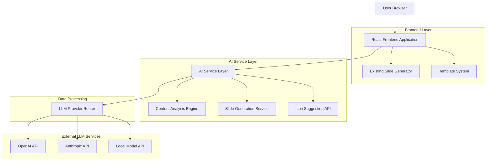
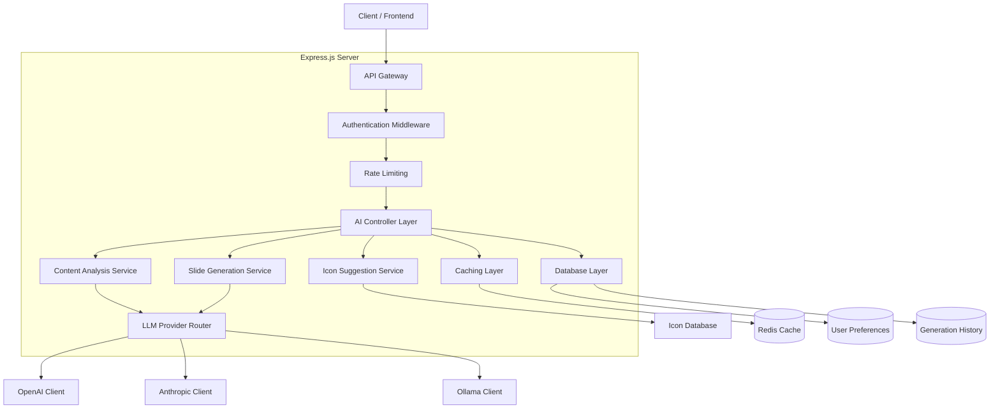
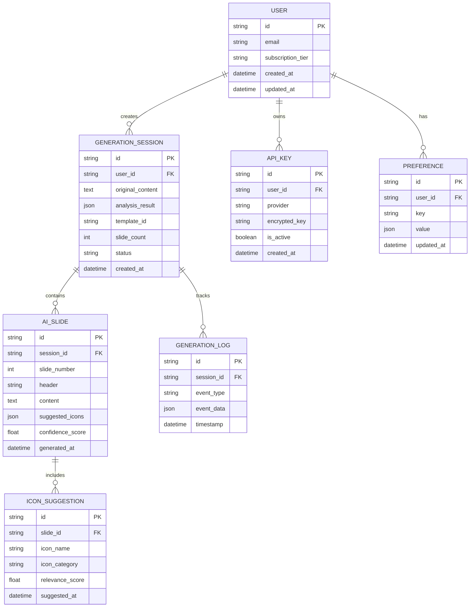

# AI-Powered Carousel Generator - Technical Architecture Document

## 1. Architecture Design



## 2. Technology Description

- Frontend: React@18 + TypeScript + Tailwind CSS + Vite
- AI Services: Node.js/Express backend for LLM integration
- LLM APIs: OpenAI GPT-4, Anthropic Claude, Ollama (local)
- State Management: React Context + Zustand for AI state
- Streaming: Server-Sent Events for real-time generation
- Caching: Redis for API response caching
- Security: JWT tokens, API key encryption

## 3. Route Definitions

| Route | Purpose |
|-------|---------|
| / | Home page with AI/manual mode selection |
| /ai-generate | AI-powered slide generation interface |
| /ai-processing | Real-time generation progress and preview |
| /slides/preview | Enhanced preview with AI editing capabilities |
| /settings/ai | AI configuration and API key management |
| /dashboard | Usage analytics and generation history |
| /manual | Traditional manual slide creation (existing) |

## 4. API Definitions

### 4.1 Core AI APIs

**Content Analysis**
```
POST /api/ai/analyze
```

Request:
| Param Name | Param Type | isRequired | Description |
|------------|------------|------------|-------------|
| content | string | true | User input text to analyze |
| contentType | string | false | Hint about content type (presentation, tutorial, etc.) |
| preferences | object | false | User preferences for analysis |

Response:
| Param Name | Param Type | Description |
|------------|------------|-------------|
| topics | string[] | Extracted main topics |
| suggestedSlideCount | number | Recommended number of slides |
| contentStructure | object | Detected structure and key points |
| templateRecommendation | string | Suggested template ID |

Example:
```json
{
  "content": "Your API isn't just a data pipe — it's your biggest attack surface. Here's how to secure it properly...",
  "contentType": "technical"
}
```

**Slide Generation**
```
POST /api/ai/generate-slides
```

Request:
| Param Name | Param Type | isRequired | Description |
|------------|------------|------------|-------------|
| content | string | true | Analyzed content |
| slideCount | number | true | Number of slides to generate |
| template | string | true | Template ID to use |
| creativity | number | false | AI creativity level (0-1) |

Response:
| Param Name | Param Type | Description |
|------------|------------|-------------|
| slides | object[] | Generated slide objects with headers, content, icons |
| confidence | number | AI confidence score |
| processingTime | number | Generation time in milliseconds |

**Icon Suggestions**
```
POST /api/ai/suggest-icons
```

Request:
| Param Name | Param Type | isRequired | Description |
|------------|------------|------------|-------------|
| slideContent | string | true | Content of specific slide |
| theme | string | false | Visual theme preference |

Response:
| Param Name | Param Type | Description |
|------------|------------|-------------|
| suggestions | object[] | Array of icon suggestions with names and relevance scores |

### 4.2 Streaming APIs

**Real-time Generation**
```
GET /api/ai/stream-generation/:sessionId
```

Server-Sent Events stream providing:
- Generation progress updates
- Partial slide content as it's created
- Error handling and retry logic
- Completion notifications

### 4.3 Configuration APIs

**API Key Management**
```
POST /api/settings/api-keys
PUT /api/settings/api-keys/:provider
DELETE /api/settings/api-keys/:provider
```

**Generation Preferences**
```
GET /api/settings/preferences
PUT /api/settings/preferences
```

## 5. Server Architecture Diagram



## 6. Data Model

### 6.1 Data Model Definition



### 6.2 Data Definition Language

**User Management Tables**
```sql
-- Users table
CREATE TABLE users (
    id UUID PRIMARY KEY DEFAULT gen_random_uuid(),
    email VARCHAR(255) UNIQUE NOT NULL,
    subscription_tier VARCHAR(20) DEFAULT 'free' CHECK (subscription_tier IN ('free', 'pro', 'enterprise')),
    created_at TIMESTAMP WITH TIME ZONE DEFAULT NOW(),
    updated_at TIMESTAMP WITH TIME ZONE DEFAULT NOW()
);

-- API Keys table (encrypted storage)
CREATE TABLE api_keys (
    id UUID PRIMARY KEY DEFAULT gen_random_uuid(),
    user_id UUID REFERENCES users(id) ON DELETE CASCADE,
    provider VARCHAR(50) NOT NULL CHECK (provider IN ('openai', 'anthropic', 'ollama')),
    encrypted_key TEXT NOT NULL,
    is_active BOOLEAN DEFAULT true,
    created_at TIMESTAMP WITH TIME ZONE DEFAULT NOW()
);

-- User preferences
CREATE TABLE preferences (
    id UUID PRIMARY KEY DEFAULT gen_random_uuid(),
    user_id UUID REFERENCES users(id) ON DELETE CASCADE,
    key VARCHAR(100) NOT NULL,
    value JSONB NOT NULL,
    updated_at TIMESTAMP WITH TIME ZONE DEFAULT NOW(),
    UNIQUE(user_id, key)
);
```

**AI Generation Tables**
```sql
-- Generation sessions
CREATE TABLE generation_sessions (
    id UUID PRIMARY KEY DEFAULT gen_random_uuid(),
    user_id UUID REFERENCES users(id) ON DELETE CASCADE,
    original_content TEXT NOT NULL,
    analysis_result JSONB,
    template_id VARCHAR(50),
    slide_count INTEGER,
    status VARCHAR(20) DEFAULT 'pending' CHECK (status IN ('pending', 'processing', 'completed', 'failed')),
    created_at TIMESTAMP WITH TIME ZONE DEFAULT NOW()
);

-- AI-generated slides
CREATE TABLE ai_slides (
    id UUID PRIMARY KEY DEFAULT gen_random_uuid(),
    session_id UUID REFERENCES generation_sessions(id) ON DELETE CASCADE,
    slide_number INTEGER NOT NULL,
    header VARCHAR(200),
    content TEXT,
    suggested_icons JSONB,
    confidence_score FLOAT CHECK (confidence_score >= 0 AND confidence_score <= 1),
    generated_at TIMESTAMP WITH TIME ZONE DEFAULT NOW()
);

-- Generation logs for debugging and analytics
CREATE TABLE generation_logs (
    id UUID PRIMARY KEY DEFAULT gen_random_uuid(),
    session_id UUID REFERENCES generation_sessions(id) ON DELETE CASCADE,
    event_type VARCHAR(50) NOT NULL,
    event_data JSONB,
    timestamp TIMESTAMP WITH TIME ZONE DEFAULT NOW()
);

-- Icon suggestions
CREATE TABLE icon_suggestions (
    id UUID PRIMARY KEY DEFAULT gen_random_uuid(),
    slide_id UUID REFERENCES ai_slides(id) ON DELETE CASCADE,
    icon_name VARCHAR(100) NOT NULL,
    icon_category VARCHAR(50),
    relevance_score FLOAT CHECK (relevance_score >= 0 AND relevance_score <= 1),
    suggested_at TIMESTAMP WITH TIME ZONE DEFAULT NOW()
);
```

**Indexes for Performance**
```sql
-- Performance indexes
CREATE INDEX idx_generation_sessions_user_id ON generation_sessions(user_id);
CREATE INDEX idx_generation_sessions_status ON generation_sessions(status);
CREATE INDEX idx_ai_slides_session_id ON ai_slides(session_id);
CREATE INDEX idx_ai_slides_slide_number ON ai_slides(slide_number);
CREATE INDEX idx_generation_logs_session_id ON generation_logs(session_id);
CREATE INDEX idx_generation_logs_timestamp ON generation_logs(timestamp DESC);
CREATE INDEX idx_icon_suggestions_slide_id ON icon_suggestions(slide_id);
CREATE INDEX idx_api_keys_user_provider ON api_keys(user_id, provider);
```

**Initial Data**
```sql
-- Default user preferences
INSERT INTO preferences (user_id, key, value) VALUES
-- Will be populated when users first use AI features
-- Example structure:
-- ('user-uuid', 'ai_creativity_level', '0.7'),
-- ('user-uuid', 'preferred_slide_count', '5'),
-- ('user-uuid', 'default_template', 'minimal');

-- Icon categories for suggestions
-- This would be populated from icon library APIs
-- Example: Lucide icons, Heroicons, etc.
```

## 7. Security and Privacy

### 7.1 API Key Security
- All API keys encrypted at rest using AES-256
- Keys never logged or exposed in responses
- Separate encryption keys per environment
- Regular key rotation capabilities

### 7.2 Content Privacy
- User content not stored permanently unless explicitly saved
- Option to process content without storage
- GDPR compliance for EU users
- Content deletion on user request

### 7.3 Rate Limiting
- Per-user rate limits based on subscription tier
- API cost monitoring and alerts
- Graceful degradation when limits exceeded
- Queue system for high-demand periods

## 8. Performance Optimization

### 8.1 Caching Strategy
- Redis cache for common content patterns
- Template-based response caching
- Icon suggestion caching by content type
- User preference caching

### 8.2 Streaming Implementation
- Server-Sent Events for real-time updates
- Chunked slide generation for faster perceived performance
- Progressive enhancement of slide content
- Fallback to polling for older browsers

### 8.3 Cost Optimization
- Intelligent prompt engineering to reduce token usage
- Batch processing for multiple slides
- Local model fallback for cost-sensitive operations
- Usage analytics to optimize API calls