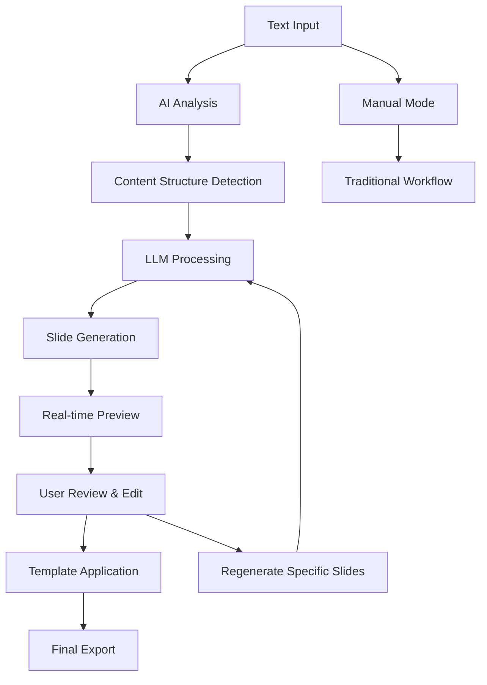
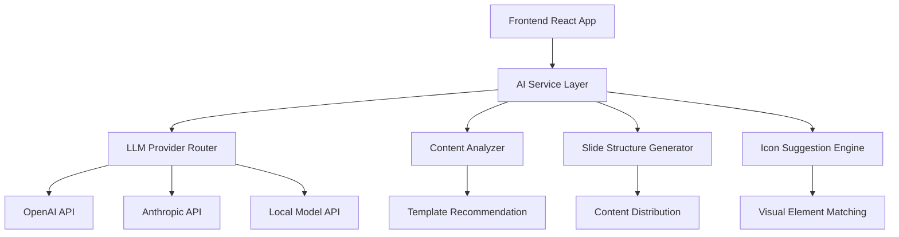
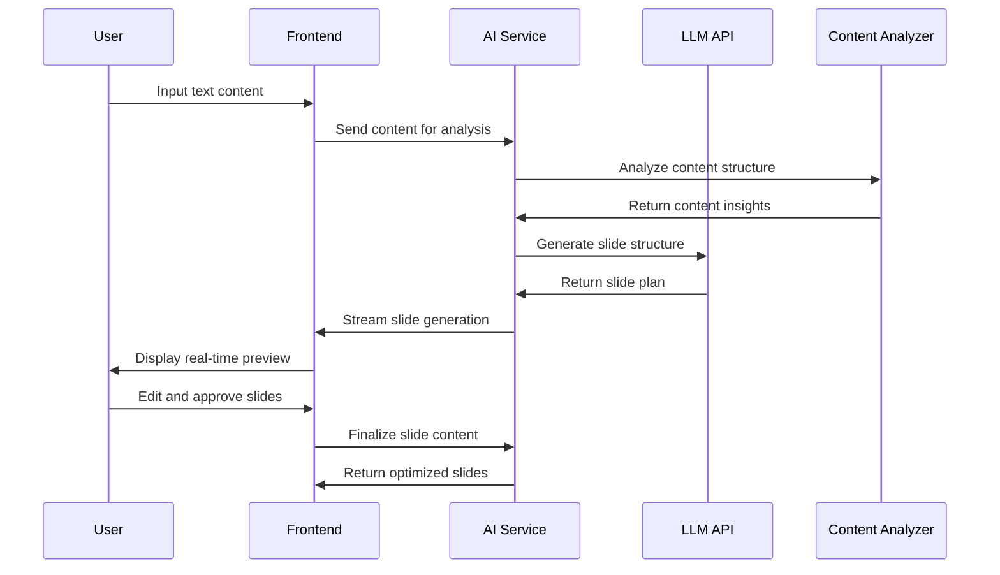

# AI-Powered Carousel Generator - Product Requirements Document

## 1. Product Overview

Transform the existing carousel generator into an intelligent AI-powered presentation tool that automatically analyzes user input text and generates optimized slide structures with headers, icons, and content distribution using LLM integration.

The enhanced product will solve the problem of manual slide creation by automatically determining the optimal number of slides, generating compelling headers, suggesting relevant icons, and distributing content intelligently across slides. This will serve content creators, marketers, educators, and professionals who need to quickly convert text content into visually appealing slide presentations.

The target is to reduce slide creation time by 80% while improving content structure and visual appeal through AI-driven optimization.

## 2. Core Features

### 2.1 User Roles

| Role | Registration Method | Core Permissions |
|------|---------------------|------------------|
| Free User | Email registration | Basic AI generation (5 slides/day), standard templates |
| Pro User | Subscription upgrade | Unlimited AI generation, premium templates, API key management |
| Enterprise User | Custom onboarding | Team collaboration, custom LLM endpoints, analytics |

### 2.2 Feature Module

Our AI-powered carousel generator consists of the following main pages:

1. **AI Input Page**: text input area, AI configuration settings, generation trigger
2. **AI Processing Page**: real-time generation progress, streaming preview, editing interface
3. **Enhanced Preview Page**: AI-generated slides with edit capabilities, template switching, regeneration options
4. **Settings Page**: API key management, LLM provider selection, generation preferences
5. **Dashboard Page**: usage analytics, generation history, saved presentations

### 2.3 Page Details

| Page Name | Module Name | Feature description |
|-----------|-------------|---------------------|
| AI Input Page | Text Input Area | Accept user text input with rich text formatting, character count, content type detection |
| AI Input Page | AI Configuration | Select LLM provider (OpenAI, Anthropic, Local), adjust creativity settings, set slide count preferences |
| AI Input Page | Generation Trigger | Analyze content button, estimated processing time, cost preview |
| AI Processing Page | Real-time Progress | Show LLM processing status, streaming slide generation, progress indicators |
| AI Processing Page | Live Preview | Display slides as they're generated, allow real-time editing, show confidence scores |
| AI Processing Page | Content Analysis | Display detected topics, suggested slide count, content structure breakdown |
| Enhanced Preview Page | AI-Generated Slides | Show complete slide deck with headers, icons, optimized content distribution |
| Enhanced Preview Page | Edit Interface | Inline editing for headers and content, icon replacement, template switching |
| Enhanced Preview Page | Regeneration Options | Regenerate specific slides, adjust AI parameters, batch operations |
| Settings Page | API Management | Secure API key storage, provider switching, usage monitoring |
| Settings Page | Generation Preferences | Default slide count, content style, icon preferences, template selection |
| Settings Page | Privacy Controls | Data retention settings, content sharing permissions, export options |
| Dashboard Page | Usage Analytics | Track generation history, cost analysis, performance metrics |
| Dashboard Page | Saved Presentations | Manage saved slide decks, sharing options, version control |

## 3. Core Process

### AI-Powered Generation Flow:
1. User inputs text content and selects AI generation mode
2. System analyzes content type and suggests optimal configuration
3. LLM processes text to determine slide structure and count
4. AI generates headers, suggests icons, and distributes content
5. Real-time preview shows slides as they're created
6. User reviews and edits generated slides
7. Final slides are rendered with chosen template
8. User downloads or shares the completed presentation

### Manual Fallback Flow:
1. User can switch to manual mode at any time
2. AI suggestions remain available as hints
3. Traditional slide creation workflow remains intact
4. Hybrid mode allows AI assistance for specific slides

## 4. User Interface Design

### 4.1 Design Style

- **Primary Colors**: Deep blue (#1e40af) for AI features, original brand colors for manual features
- **Secondary Colors**: Green (#10b981) for success states, amber (#f59e0b) for processing
- **Button Style**: Rounded buttons with gradient effects for AI features, flat design for manual controls
- **Font**: Inter for UI elements, Poppins for slide content, monospace for code/JSON
- **Layout Style**: Card-based design with clear AI/manual mode distinction, floating action buttons for quick access
- **Icons**: Lucide icons with custom AI-themed additions (brain, magic wand, sparkles)

### 4.2 Page Design Overview

| Page Name | Module Name | UI Elements |
|-----------|-------------|-------------|
| AI Input Page | Text Input Area | Large textarea with syntax highlighting, character counter, content type badges |
| AI Input Page | AI Configuration | Dropdown selectors with provider logos, slider controls for creativity, toggle switches |
| AI Processing Page | Progress Display | Animated progress bars, streaming text preview, confidence meters with color coding |
| AI Processing Page | Live Preview | Split-screen layout, real-time slide updates, floating edit controls |
| Enhanced Preview Page | AI Slides | Enhanced slide cards with AI badges, edit overlays, regeneration buttons |
| Settings Page | API Management | Secure input fields with masking, status indicators, usage charts |

### 4.3 Responsiveness

Desktop-first design with mobile-adaptive AI features. Touch-optimized editing controls for mobile devices, with simplified AI configuration on smaller screens.

## 5. Technical Architecture

### 5.1 LLM Integration Architecture

### 5.2 AI Processing Pipeline

1. **Content Analysis**: Extract topics, sentiment, structure, and key points
2. **Slide Planning**: Determine optimal slide count and content distribution
3. **Header Generation**: Create compelling titles for each slide
4. **Icon Matching**: Suggest relevant icons based on content themes
5. **Template Selection**: Recommend best template based on content type
6. **Content Optimization**: Refine text for slide format and readability

### 5.3 API Integration Requirements

- **OpenAI GPT-4**: For high-quality content analysis and generation
- **Anthropic Claude**: Alternative provider for content processing
- **Local Models**: Ollama integration for privacy-focused users
- **Icon APIs**: Integration with icon libraries for visual suggestions
- **Rate Limiting**: Implement queue system for API calls
- **Caching**: Store common patterns and responses for efficiency

### 5.4 Data Flow

## 6. AI Features Specification

### 6.1 Content Analysis Engine

- **Topic Extraction**: Identify main themes and subtopics
- **Sentiment Analysis**: Determine appropriate visual tone
- **Structure Detection**: Recognize lists, processes, comparisons
- **Key Point Identification**: Extract most important information
- **Content Type Classification**: Presentation, tutorial, report, etc.

### 6.2 Slide Generation Intelligence

- **Optimal Slide Count**: Calculate based on content volume and complexity
- **Content Distribution**: Balance information across slides
- **Header Generation**: Create engaging, descriptive titles
- **Visual Element Suggestions**: Recommend icons, colors, layouts
- **Template Matching**: Select best template for content type

### 6.3 User Control and Customization

- **AI Creativity Levels**: Conservative, balanced, creative generation modes
- **Content Preferences**: Formal, casual, technical, marketing tones
- **Slide Count Override**: User can specify desired number of slides
- **Regeneration Controls**: Regenerate individual slides or entire deck
- **Manual Override**: Switch between AI and manual mode seamlessly

## 7. Implementation Phases

### Phase 1: Core AI Integration (4 weeks)
- Basic LLM API integration
- Simple content analysis
- Automatic slide count determination
- Basic header generation

### Phase 2: Enhanced Intelligence (3 weeks)
- Advanced content structure analysis
- Icon suggestion system
- Template recommendation engine
- Real-time preview with streaming

### Phase 3: User Experience (2 weeks)
- Editing interface for AI-generated content
- Settings and preferences management
- Usage analytics and history
- Mobile optimization

### Phase 4: Advanced Features (3 weeks)
- Multiple LLM provider support
- Local model integration
- Team collaboration features
- Enterprise-grade security

## 8. Success Metrics

- **Generation Accuracy**: 85%+ user satisfaction with AI-generated slides
- **Time Savings**: 80% reduction in slide creation time
- **User Adoption**: 70% of users prefer AI mode over manual
- **Content Quality**: Improved readability and structure scores
- **API Efficiency**: <2 second average generation time per slide